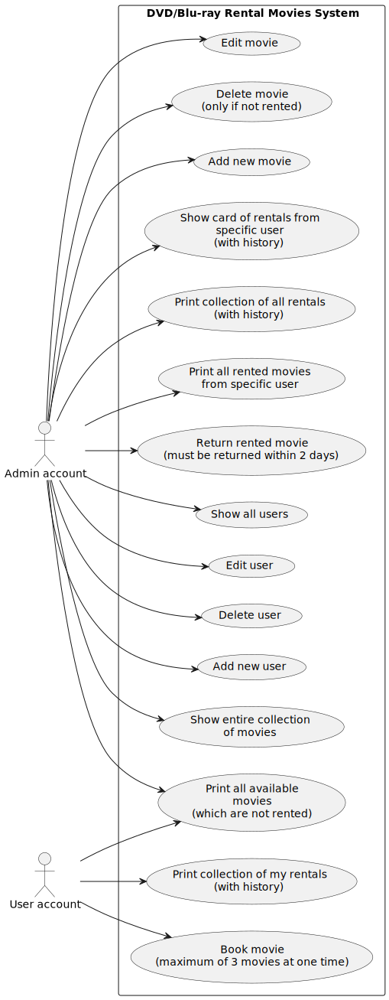
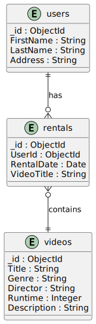
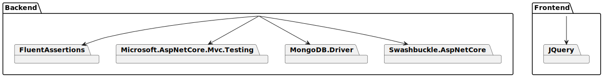

# Aplikacja Wypożyczalni Wideo

## 1. Wymagania 

- .NET 8.0 SDK
- MongoDB
- WSL/Linux
- Docker

## 2. Opis

**DVD/Blu-ray Movie Rental System** to kompleksowa aplikacja zaprojektowana do zarządzania operacjami w wypożyczalni wideo. Oferuje szeroki zakres funkcji dostosowanych do potrzeb administratorów i zwykłych użytkowników, zapewniając efektywne zarządzanie wypożyczeniami wideo i informacjami o użytkownikach. System jest przeznaczony dla właścicieli wypożyczalni DVD/Blu-ray.

System został napisany w następujących językach programowania:

#### Backend:
C# (framework ASP.NET Core)
#### Frontend:
- JavaScript (+ jQuery)

Dodatkowo, do stworzenia interfejsu użytkownika wykorzystano:
- HTML
- CSS

#### Uwagi
C# z ASP.NET Core został użyty do budowy backendu systemu, obsługującego logikę biznesową oraz interakcję z bazą danych MongoDB.
JavaScript z jQuery został użyty do implementacji interaktywnego interfejsu użytkownika frontendu systemu.

## 3. Użycie

Aby uruchomić aplikację, wykonaj następujące kroki:

1. Przejdź do głównego katalogu i uruchom plik `.sh`, aby utworzyć obrazy i kontenery:

    ```bash
    bash run_docker.sh
    ```

2. Aplikacja jest dostępna pod adresem:

    ```
    https://localhost:6001
    ```

## 4. Funkcje

### Zarządzanie Wideo

- Dodawanie nowego wideo
- Usuwanie wideo (tylko jeśli nie jest wypożyczone)
- Edycja wideo *(częściowo)*
- Wyświetlanie całej kolekcji filmów
- Wyświetlanie wszystkich dostępnych filmów (które nie są wypożyczone)

### Zarządzanie Użytkownikami

- Dodawanie nowego użytkownika
- Usuwanie użytkownika
- Edycja użytkownika *(częściowo)*
- Wyświetlanie wszystkich użytkowników

### Operacje Wypożyczeń

- Wypożyczanie filmu (**maksymalnie 3 filmy**)
- Zwrot wypożyczonego filmu (**musi być zwrócony w ciągu 2 dni**)
- Wyświetlanie wszystkich wypożyczonych filmów przez konkretnego użytkownika
- Wyświetlanie historii wszystkich wypożyczeń
- Wyświetlanie karty wypożyczeń dla konkretnego użytkownika (z historią)

### Typy Kont

- Konto administratora:
  - Nieograniczony dostęp do wszystkich funkcji
- Konto użytkownika:
  - Ograniczony dostęp do:
    - Wyświetlania wszystkich dostępnych filmów
    - Wyświetlania historii moich wypożyczeń
    - Wypożyczania filmów

## 5. Biblioteki

Aplikacja korzysta z różnych bibliotek zewnętrznych:

### Backend

- FluentAssertions
- Microsoft.AspNetCore.Mvc.Testing
- MongoDB.Driver
- Swashbuckle.AspNetCore

### Frontend

- JQuery

## 6. Use Case Diagram



## 7. Relacje - próba odwzorowania zależności między dokumentami



## 8. Zależności

