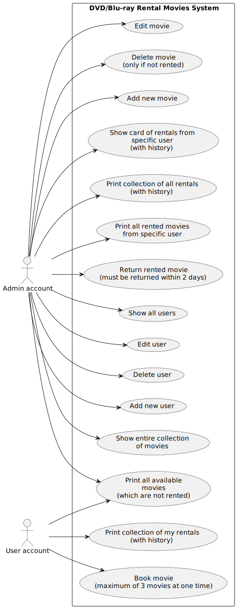
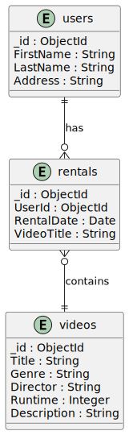
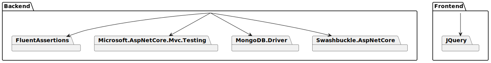

# DVD/Blu-ray Movie Rental

## 1. Requirements 

- .NET 8.0 SDK
- MongoDB
- WSL/Linux
- Docker

## 2. Description

The **DVD/Blu-ray Movie Rental System** is a comprehensive application designed to manage operations within a video rental store. It offers a wide range of functionalities tailored to the needs of both administrators and regular users, ensuring efficient management of video rentals and user information. The system is intended for owners of DVD/Blu-ray rental stores.

### Programming Languages

#### Backend:
- C# (ASP.NET Core framework)

#### Frontend:
- JavaScript (with jQuery)

Additionally, the user interface was created using:
- HTML
- CSS

### Notes

- C# with ASP.NET Core was used to build the system's backend, handling business logic and interactions with the MongoDB database.
- JavaScript with jQuery was used to implement the interactive user interface for the system's frontend.

## 3. Usage

To run the app, follow these instructions:

1. Move to the main directory and execute the `.sh` file to create images and containers:

    ```bash
    bash run_docker.sh
    ```

2. Access the web application at:

    ```
    https://localhost:6001
    ```

## 4. Features

### Video Management

- Add new video
- Delete video (only if it is not rented)
- Edit video
- Show entire collection of movies
- Print all available movies (which are not rented)

### User Management

- Add new user
- Delete user
- Edit user
- Show all users

### Rental Operations

- Rent a movie (**maximum of 3 videos**)
- Return rented video (**must be returned within 2 days**)
- Print all rented movies from a specific user
- Print collection of all rentals (with history)
- Show card of rentals from specific user (with history)

### Account Types

- Admin account:
  - Unlimited access to all features
- User account:
  - Limited access to:
    - Print all available movies
    - Print collection of my rentals
    - Book a movie

## 5. Libraries

This application uses various external libraries:

### Backend

- FluentAssertions
- Microsoft.AspNetCore.Mvc.Testing
- MongoDB.Driver
- Swashbuckle.AspNetCore

### Frontend

- JQuery

## 6. Use Case Diagram



## 7. Relations



## 8. Dependencies



## 9. API docs

<!-- Generator: Widdershins v4.0.1 -->

<h1 id="videorentalstoreapp">VideoRentalStoreApp v1</h1>

> Scroll down for code samples, example requests and responses. Select a language for code samples from the tabs above or the mobile navigation menu.

<h1 id="videorentalstoreapp-videorentalstore">VideoRentalStore</h1>

## get__VideoRentalStore_GetUsersWhoHaveRentedVideos

`GET /VideoRentalStore/GetUsersWhoHaveRentedVideos`

> Example responses

> 200 Response

```
[{"id":"string","firstName":"string","lastName":"string","address":"string","contact":0,"registrationDate":"2019-08-24T14:15:22Z"}]
```

```json
[
  {
    "id": "string",
    "firstName": "string",
    "lastName": "string",
    "address": "string",
    "contact": 0,
    "registrationDate": "2019-08-24T14:15:22Z"
  }
]
```

<h3 id="get__videorentalstore_getuserswhohaverentedvideos-responses">Responses</h3>

|Status|Meaning|Description|Schema|
|---|---|---|---|
|200|[OK](https://tools.ietf.org/html/rfc7231#section-6.3.1)|OK|Inline|

<h3 id="get__videorentalstore_getuserswhohaverentedvideos-responseschema">Response Schema</h3>

Status Code **200**

|Name|Type|Required|Restrictions|Description|
|---|---|---|---|---|
|*anonymous*|[[UserResult](#schemauserresult)]|false|none|none|
|» id|string¦null|false|none|none|
|» firstName|string¦null|false|none|none|
|» lastName|string¦null|false|none|none|
|» address|string¦null|false|none|none|
|» contact|integer(int64)|false|none|none|
|» registrationDate|string(date-time)|false|none|none|

<aside class="success">
This operation does not require authentication
</aside>

## get__VideoRentalStore_GetMyVideos_{id}

`GET /VideoRentalStore/GetMyVideos/{id}`

<h3 id="get__videorentalstore_getmyvideos_{id}-parameters">Parameters</h3>

|Name|In|Type|Required|Description|
|---|---|---|---|---|
|id|path|string|true|none|

> Example responses

> 200 Response

```
[{"id":"string","title":"string","genre":"string","director":"string","runtime":0,"score":0.1,"description":"string","actors":["string"],"createdDate":"2019-08-24T14:15:22Z","isAvailable":true}]
```

```json
[
  {
    "id": "string",
    "title": "string",
    "genre": "string",
    "director": "string",
    "runtime": 0,
    "score": 0.1,
    "description": "string",
    "actors": [
      "string"
    ],
    "createdDate": "2019-08-24T14:15:22Z",
    "isAvailable": true
  }
]
```

<h3 id="get__videorentalstore_getmyvideos_{id}-responses">Responses</h3>

|Status|Meaning|Description|Schema|
|---|---|---|---|
|200|[OK](https://tools.ietf.org/html/rfc7231#section-6.3.1)|OK|Inline|

<h3 id="get__videorentalstore_getmyvideos_{id}-responseschema">Response Schema</h3>

Status Code **200**

|Name|Type|Required|Restrictions|Description|
|---|---|---|---|---|
|*anonymous*|[[VideoResult](#schemavideoresult)]|false|none|none|
|» id|string¦null|false|none|none|
|» title|string¦null|false|none|none|
|» genre|string¦null|false|none|none|
|» director|string¦null|false|none|none|
|» runtime|integer(int32)|false|none|none|
|» score|number(double)|false|none|none|
|» description|string¦null|false|none|none|
|» actors|[string]¦null|false|none|none|
|» createdDate|string(date-time)|false|none|none|
|» isAvailable|boolean|false|none|none|

<aside class="success">
This operation does not require authentication
</aside>

## get__VideoRentalStore_GetLoginUsers

`GET /VideoRentalStore/GetLoginUsers`

> Example responses

> 200 Response

```
[{"id":"string","user":"string","password":"string"}]
```

```json
[
  {
    "id": "string",
    "user": "string",
    "password": "string"
  }
]
```

<h3 id="get__videorentalstore_getloginusers-responses">Responses</h3>

|Status|Meaning|Description|Schema|
|---|---|---|---|
|200|[OK](https://tools.ietf.org/html/rfc7231#section-6.3.1)|OK|Inline|

<h3 id="get__videorentalstore_getloginusers-responseschema">Response Schema</h3>

Status Code **200**

|Name|Type|Required|Restrictions|Description|
|---|---|---|---|---|
|*anonymous*|[[LoginResult](#schemaloginresult)]|false|none|none|
|» id|string¦null|false|none|none|
|» user|string¦null|false|none|none|
|» password|string¦null|false|none|none|

<aside class="success">
This operation does not require authentication
</aside>

## get__VideoRentalStore_GetListOfRents

`GET /VideoRentalStore/GetListOfRents`

> Example responses

> 200 Response

```
[{"id":"string","firstName":"string","lastName":"string","address":"string","contact":0,"registrationDate":"2019-08-24T14:15:22Z","title":"string","startRentalDate":"2019-08-24T14:15:22Z","endRentalDate":"2019-08-24T14:15:22Z","realEndOfRentalDate":"2019-08-24T14:15:22Z"}]
```

```json
[
  {
    "id": "string",
    "firstName": "string",
    "lastName": "string",
    "address": "string",
    "contact": 0,
    "registrationDate": "2019-08-24T14:15:22Z",
    "title": "string",
    "startRentalDate": "2019-08-24T14:15:22Z",
    "endRentalDate": "2019-08-24T14:15:22Z",
    "realEndOfRentalDate": "2019-08-24T14:15:22Z"
  }
]
```

<h3 id="get__videorentalstore_getlistofrents-responses">Responses</h3>

|Status|Meaning|Description|Schema|
|---|---|---|---|
|200|[OK](https://tools.ietf.org/html/rfc7231#section-6.3.1)|OK|Inline|

<h3 id="get__videorentalstore_getlistofrents-responseschema">Response Schema</h3>

Status Code **200**

|Name|Type|Required|Restrictions|Description|
|---|---|---|---|---|
|*anonymous*|[[UserRentedVideosResults](#schemauserrentedvideosresults)]|false|none|none|
|» id|string¦null|false|none|none|
|» firstName|string¦null|false|none|none|
|» lastName|string¦null|false|none|none|
|» address|string¦null|false|none|none|
|» contact|integer(int64)|false|none|none|
|» registrationDate|string(date-time)|false|none|none|
|» title|string¦null|false|none|none|
|» startRentalDate|string(date-time)|false|none|none|
|» endRentalDate|string(date-time)|false|none|none|
|» realEndOfRentalDate|string(date-time)¦null|false|none|none|

<aside class="success">
This operation does not require authentication
</aside>

## put__VideoRentalStore_ReturnRentedVideoById

`PUT /VideoRentalStore/ReturnRentedVideoById`

> Body parameter

```json
{
  "userId": "string",
  "title": "string"
}
```

<h3 id="put__videorentalstore_returnrentedvideobyid-parameters">Parameters</h3>

|Name|In|Type|Required|Description|
|---|---|---|---|---|
|body|body|[RentFilmByIdCriteria](#schemarentfilmbyidcriteria)|false|none|

> Example responses

> 200 Response

```
true
```

```json
true
```

<h3 id="put__videorentalstore_returnrentedvideobyid-responses">Responses</h3>

|Status|Meaning|Description|Schema|
|---|---|---|---|
|200|[OK](https://tools.ietf.org/html/rfc7231#section-6.3.1)|OK|boolean|

<aside class="success">
This operation does not require authentication
</aside>

## put__VideoRentalStore_ReturnRentedVideoByNames

`PUT /VideoRentalStore/ReturnRentedVideoByNames`

> Body parameter

```json
{
  "firstName": "string",
  "lastName": "string",
  "title": "string"
}
```

<h3 id="put__videorentalstore_returnrentedvideobynames-parameters">Parameters</h3>

|Name|In|Type|Required|Description|
|---|---|---|---|---|
|body|body|[RentFilmByNamesCriteria](#schemarentfilmbynamescriteria)|false|none|

> Example responses

> 200 Response

```
true
```

```json
true
```

<h3 id="put__videorentalstore_returnrentedvideobynames-responses">Responses</h3>

|Status|Meaning|Description|Schema|
|---|---|---|---|
|200|[OK](https://tools.ietf.org/html/rfc7231#section-6.3.1)|OK|boolean|

<aside class="success">
This operation does not require authentication
</aside>

## get__VideoRentalStore_GetAvailableVideos

`GET /VideoRentalStore/GetAvailableVideos`

<h3 id="get__videorentalstore_getavailablevideos-parameters">Parameters</h3>

|Name|In|Type|Required|Description|
|---|---|---|---|---|
|sortByTitle|query|boolean|false|none|
|sortByGenre|query|boolean|false|none|

> Example responses

> 200 Response

```
[{"id":"string","title":"string","genre":"string","director":"string","runtime":0,"score":0.1,"description":"string","actors":["string"],"createdDate":"2019-08-24T14:15:22Z","isAvailable":true}]
```

```json
[
  {
    "id": "string",
    "title": "string",
    "genre": "string",
    "director": "string",
    "runtime": 0,
    "score": 0.1,
    "description": "string",
    "actors": [
      "string"
    ],
    "createdDate": "2019-08-24T14:15:22Z",
    "isAvailable": true
  }
]
```

<h3 id="get__videorentalstore_getavailablevideos-responses">Responses</h3>

|Status|Meaning|Description|Schema|
|---|---|---|---|
|200|[OK](https://tools.ietf.org/html/rfc7231#section-6.3.1)|OK|Inline|

<h3 id="get__videorentalstore_getavailablevideos-responseschema">Response Schema</h3>

Status Code **200**

|Name|Type|Required|Restrictions|Description|
|---|---|---|---|---|
|*anonymous*|[[VideoResult](#schemavideoresult)]|false|none|none|
|» id|string¦null|false|none|none|
|» title|string¦null|false|none|none|
|» genre|string¦null|false|none|none|
|» director|string¦null|false|none|none|
|» runtime|integer(int32)|false|none|none|
|» score|number(double)|false|none|none|
|» description|string¦null|false|none|none|
|» actors|[string]¦null|false|none|none|
|» createdDate|string(date-time)|false|none|none|
|» isAvailable|boolean|false|none|none|

<aside class="success">
This operation does not require authentication
</aside>

## get__VideoRentalStore_GetAvailableVideoShort

`GET /VideoRentalStore/GetAvailableVideoShort`

<h3 id="get__videorentalstore_getavailablevideoshort-parameters">Parameters</h3>

|Name|In|Type|Required|Description|
|---|---|---|---|---|
|sortByTitle|query|boolean|false|none|
|sortByGenre|query|boolean|false|none|

> Example responses

> 200 Response

```
[{"id":"string","title":"string","genre":"string","director":"string","runtime":0,"isAvailable":true}]
```

```json
[
  {
    "id": "string",
    "title": "string",
    "genre": "string",
    "director": "string",
    "runtime": 0,
    "isAvailable": true
  }
]
```

<h3 id="get__videorentalstore_getavailablevideoshort-responses">Responses</h3>

|Status|Meaning|Description|Schema|
|---|---|---|---|
|200|[OK](https://tools.ietf.org/html/rfc7231#section-6.3.1)|OK|Inline|

<h3 id="get__videorentalstore_getavailablevideoshort-responseschema">Response Schema</h3>

Status Code **200**

|Name|Type|Required|Restrictions|Description|
|---|---|---|---|---|
|*anonymous*|[[VideoShortResult](#schemavideoshortresult)]|false|none|none|
|» id|string¦null|false|none|none|
|» title|string¦null|false|none|none|
|» genre|string¦null|false|none|none|
|» director|string¦null|false|none|none|
|» runtime|integer(int32)|false|none|none|
|» isAvailable|boolean|false|none|none|

<aside class="success">
This operation does not require authentication
</aside>

## post__VideoRentalStore_RentFilmByNames

`POST /VideoRentalStore/RentFilmByNames`

> Body parameter

```json
{
  "firstName": "string",
  "lastName": "string",
  "title": "string"
}
```

<h3 id="post__videorentalstore_rentfilmbynames-parameters">Parameters</h3>

|Name|In|Type|Required|Description|
|---|---|---|---|---|
|body|body|[RentFilmByNamesCriteria](#schemarentfilmbynamescriteria)|false|none|

> Example responses

> 200 Response

```
true
```

```json
true
```

<h3 id="post__videorentalstore_rentfilmbynames-responses">Responses</h3>

|Status|Meaning|Description|Schema|
|---|---|---|---|
|200|[OK](https://tools.ietf.org/html/rfc7231#section-6.3.1)|OK|boolean|

<aside class="success">
This operation does not require authentication
</aside>

## post__VideoRentalStore_RentFilmById

`POST /VideoRentalStore/RentFilmById`

> Body parameter

```json
{
  "userId": "string",
  "title": "string"
}
```

<h3 id="post__videorentalstore_rentfilmbyid-parameters">Parameters</h3>

|Name|In|Type|Required|Description|
|---|---|---|---|---|
|body|body|[RentFilmByIdCriteria](#schemarentfilmbyidcriteria)|false|none|

> Example responses

> 200 Response

```
true
```

```json
true
```

<h3 id="post__videorentalstore_rentfilmbyid-responses">Responses</h3>

|Status|Meaning|Description|Schema|
|---|---|---|---|
|200|[OK](https://tools.ietf.org/html/rfc7231#section-6.3.1)|OK|boolean|

<aside class="success">
This operation does not require authentication
</aside>

## get__VideoRentalStore_GetUsers

`GET /VideoRentalStore/GetUsers`

> Example responses

> 200 Response

```
[{"id":"string","firstName":"string","lastName":"string","address":"string","contact":0,"registrationDate":"2019-08-24T14:15:22Z"}]
```

```json
[
  {
    "id": "string",
    "firstName": "string",
    "lastName": "string",
    "address": "string",
    "contact": 0,
    "registrationDate": "2019-08-24T14:15:22Z"
  }
]
```

<h3 id="get__videorentalstore_getusers-responses">Responses</h3>

|Status|Meaning|Description|Schema|
|---|---|---|---|
|200|[OK](https://tools.ietf.org/html/rfc7231#section-6.3.1)|OK|Inline|

<h3 id="get__videorentalstore_getusers-responseschema">Response Schema</h3>

Status Code **200**

|Name|Type|Required|Restrictions|Description|
|---|---|---|---|---|
|*anonymous*|[[UserResult](#schemauserresult)]|false|none|none|
|» id|string¦null|false|none|none|
|» firstName|string¦null|false|none|none|
|» lastName|string¦null|false|none|none|
|» address|string¦null|false|none|none|
|» contact|integer(int64)|false|none|none|
|» registrationDate|string(date-time)|false|none|none|

<aside class="success">
This operation does not require authentication
</aside>

## get__VideoRentalStore_GetVideos

`GET /VideoRentalStore/GetVideos`

> Example responses

> 200 Response

```
[{"id":"string","title":"string","genre":"string","director":"string","runtime":0,"score":0.1,"description":"string","actors":["string"],"createdDate":"2019-08-24T14:15:22Z","isAvailable":true}]
```

```json
[
  {
    "id": "string",
    "title": "string",
    "genre": "string",
    "director": "string",
    "runtime": 0,
    "score": 0.1,
    "description": "string",
    "actors": [
      "string"
    ],
    "createdDate": "2019-08-24T14:15:22Z",
    "isAvailable": true
  }
]
```

<h3 id="get__videorentalstore_getvideos-responses">Responses</h3>

|Status|Meaning|Description|Schema|
|---|---|---|---|
|200|[OK](https://tools.ietf.org/html/rfc7231#section-6.3.1)|OK|Inline|

<h3 id="get__videorentalstore_getvideos-responseschema">Response Schema</h3>

Status Code **200**

|Name|Type|Required|Restrictions|Description|
|---|---|---|---|---|
|*anonymous*|[[VideoResult](#schemavideoresult)]|false|none|none|
|» id|string¦null|false|none|none|
|» title|string¦null|false|none|none|
|» genre|string¦null|false|none|none|
|» director|string¦null|false|none|none|
|» runtime|integer(int32)|false|none|none|
|» score|number(double)|false|none|none|
|» description|string¦null|false|none|none|
|» actors|[string]¦null|false|none|none|
|» createdDate|string(date-time)|false|none|none|
|» isAvailable|boolean|false|none|none|

<aside class="success">
This operation does not require authentication
</aside>

## get__VideoRentalStore_GetVideoRentals

`GET /VideoRentalStore/GetVideoRentals`

> Example responses

> 200 Response

```
[{"id":"string","userId":"string","firstName":"string","lastName":"string","videos":[{"title":"string","startRentalDate":"2019-08-24T14:15:22Z","endRentalDate":"2019-08-24T14:15:22Z","realEndOfRentalDate":"2019-08-24T14:15:22Z"}]}]
```

```json
[
  {
    "id": "string",
    "userId": "string",
    "firstName": "string",
    "lastName": "string",
    "videos": [
      {
        "title": "string",
        "startRentalDate": "2019-08-24T14:15:22Z",
        "endRentalDate": "2019-08-24T14:15:22Z",
        "realEndOfRentalDate": "2019-08-24T14:15:22Z"
      }
    ]
  }
]
```

<h3 id="get__videorentalstore_getvideorentals-responses">Responses</h3>

|Status|Meaning|Description|Schema|
|---|---|---|---|
|200|[OK](https://tools.ietf.org/html/rfc7231#section-6.3.1)|OK|Inline|

<h3 id="get__videorentalstore_getvideorentals-responseschema">Response Schema</h3>

Status Code **200**

|Name|Type|Required|Restrictions|Description|
|---|---|---|---|---|
|*anonymous*|[[VideoRentalResult](#schemavideorentalresult)]|false|none|none|
|» id|string¦null|false|none|none|
|» userId|string¦null|false|none|none|
|» firstName|string¦null|false|none|none|
|» lastName|string¦null|false|none|none|
|» videos|[[VideoRentResult](#schemavideorentresult)]¦null|false|none|none|
|»» title|string¦null|false|none|none|
|»» startRentalDate|string(date-time)|false|none|none|
|»» endRentalDate|string(date-time)|false|none|none|
|»» realEndOfRentalDate|string(date-time)¦null|false|none|none|

<aside class="success">
This operation does not require authentication
</aside>

## get__VideoRentalStore_GetUser_{id}

`GET /VideoRentalStore/GetUser/{id}`

<h3 id="get__videorentalstore_getuser_{id}-parameters">Parameters</h3>

|Name|In|Type|Required|Description|
|---|---|---|---|---|
|id|path|string|true|none|

> Example responses

> 200 Response

```
{"id":"string","firstName":"string","lastName":"string","address":"string","contact":0,"registrationDate":"2019-08-24T14:15:22Z"}
```

```json
{
  "id": "string",
  "firstName": "string",
  "lastName": "string",
  "address": "string",
  "contact": 0,
  "registrationDate": "2019-08-24T14:15:22Z"
}
```

<h3 id="get__videorentalstore_getuser_{id}-responses">Responses</h3>

|Status|Meaning|Description|Schema|
|---|---|---|---|
|200|[OK](https://tools.ietf.org/html/rfc7231#section-6.3.1)|OK|[UserResult](#schemauserresult)|

<aside class="success">
This operation does not require authentication
</aside>

## get__VideoRentalStore_GetVideo_{id}

`GET /VideoRentalStore/GetVideo/{id}`

<h3 id="get__videorentalstore_getvideo_{id}-parameters">Parameters</h3>

|Name|In|Type|Required|Description|
|---|---|---|---|---|
|id|path|string|true|none|

> Example responses

> 200 Response

```
{"id":"string","title":"string","genre":"string","director":"string","runtime":0,"score":0.1,"description":"string","actors":["string"],"createdDate":"2019-08-24T14:15:22Z","isAvailable":true}
```

```json
{
  "id": "string",
  "title": "string",
  "genre": "string",
  "director": "string",
  "runtime": 0,
  "score": 0.1,
  "description": "string",
  "actors": [
    "string"
  ],
  "createdDate": "2019-08-24T14:15:22Z",
  "isAvailable": true
}
```

<h3 id="get__videorentalstore_getvideo_{id}-responses">Responses</h3>

|Status|Meaning|Description|Schema|
|---|---|---|---|
|200|[OK](https://tools.ietf.org/html/rfc7231#section-6.3.1)|OK|[VideoResult](#schemavideoresult)|

<aside class="success">
This operation does not require authentication
</aside>

## get__VideoRentalStore_GetVideoRental_{id}

`GET /VideoRentalStore/GetVideoRental/{id}`

<h3 id="get__videorentalstore_getvideorental_{id}-parameters">Parameters</h3>

|Name|In|Type|Required|Description|
|---|---|---|---|---|
|id|path|string|true|none|

> Example responses

> 200 Response

```
{"id":"string","userId":"string","firstName":"string","lastName":"string","videos":[{"title":"string","startRentalDate":"2019-08-24T14:15:22Z","endRentalDate":"2019-08-24T14:15:22Z","realEndOfRentalDate":"2019-08-24T14:15:22Z"}]}
```

```json
{
  "id": "string",
  "userId": "string",
  "firstName": "string",
  "lastName": "string",
  "videos": [
    {
      "title": "string",
      "startRentalDate": "2019-08-24T14:15:22Z",
      "endRentalDate": "2019-08-24T14:15:22Z",
      "realEndOfRentalDate": "2019-08-24T14:15:22Z"
    }
  ]
}
```

<h3 id="get__videorentalstore_getvideorental_{id}-responses">Responses</h3>

|Status|Meaning|Description|Schema|
|---|---|---|---|
|200|[OK](https://tools.ietf.org/html/rfc7231#section-6.3.1)|OK|[VideoRentalResult](#schemavideorentalresult)|

<aside class="success">
This operation does not require authentication
</aside>

## post__VideoRentalStore_InsertUser

`POST /VideoRentalStore/InsertUser`

> Body parameter

```json
{
  "firstName": "string",
  "lastName": "string",
  "address": "string",
  "contact": 0
}
```

<h3 id="post__videorentalstore_insertuser-parameters">Parameters</h3>

|Name|In|Type|Required|Description|
|---|---|---|---|---|
|body|body|[UserCriteria](#schemausercriteria)|false|none|

<h3 id="post__videorentalstore_insertuser-responses">Responses</h3>

|Status|Meaning|Description|Schema|
|---|---|---|---|
|200|[OK](https://tools.ietf.org/html/rfc7231#section-6.3.1)|OK|None|

<aside class="success">
This operation does not require authentication
</aside>

## post__VideoRentalStore_InsertVideo

`POST /VideoRentalStore/InsertVideo`

> Body parameter

```json
{
  "title": "string",
  "genre": "string",
  "director": "string",
  "runtime": 0,
  "score": 0.1,
  "description": "string",
  "actors": [
    "string"
  ],
  "isAvailable": true
}
```

<h3 id="post__videorentalstore_insertvideo-parameters">Parameters</h3>

|Name|In|Type|Required|Description|
|---|---|---|---|---|
|body|body|[VideoCriteria](#schemavideocriteria)|false|none|

<h3 id="post__videorentalstore_insertvideo-responses">Responses</h3>

|Status|Meaning|Description|Schema|
|---|---|---|---|
|200|[OK](https://tools.ietf.org/html/rfc7231#section-6.3.1)|OK|None|

<aside class="success">
This operation does not require authentication
</aside>

## post__VideoRentalStore_InsertVideoRental

`POST /VideoRentalStore/InsertVideoRental`

> Body parameter

```json
{
  "userId": "string",
  "firstName": "string",
  "lastName": "string",
  "videos": [
    {
      "title": "string",
      "startRentalDate": "2019-08-24T14:15:22Z",
      "endRentalDate": "2019-08-24T14:15:22Z",
      "realEndOfRentalDate": "2019-08-24T14:15:22Z"
    }
  ]
}
```

<h3 id="post__videorentalstore_insertvideorental-parameters">Parameters</h3>

|Name|In|Type|Required|Description|
|---|---|---|---|---|
|body|body|[VideoRentalCriteria](#schemavideorentalcriteria)|false|none|

<h3 id="post__videorentalstore_insertvideorental-responses">Responses</h3>

|Status|Meaning|Description|Schema|
|---|---|---|---|
|200|[OK](https://tools.ietf.org/html/rfc7231#section-6.3.1)|OK|None|

<aside class="success">
This operation does not require authentication
</aside>

## put__VideoRentalStore_UpdateUser_{id}

`PUT /VideoRentalStore/UpdateUser/{id}`

> Body parameter

```json
{
  "firstName": "string",
  "lastName": "string",
  "address": "string",
  "contact": 0
}
```

<h3 id="put__videorentalstore_updateuser_{id}-parameters">Parameters</h3>

|Name|In|Type|Required|Description|
|---|---|---|---|---|
|id|path|string|true|none|
|body|body|[UserCriteria](#schemausercriteria)|false|none|

<h3 id="put__videorentalstore_updateuser_{id}-responses">Responses</h3>

|Status|Meaning|Description|Schema|
|---|---|---|---|
|200|[OK](https://tools.ietf.org/html/rfc7231#section-6.3.1)|OK|None|

<aside class="success">
This operation does not require authentication
</aside>

## put__VideoRentalStore_UpdateVideo_{id}

`PUT /VideoRentalStore/UpdateVideo/{id}`

> Body parameter

```json
{
  "title": "string",
  "genre": "string",
  "director": "string",
  "runtime": 0,
  "score": 0.1,
  "description": "string",
  "actors": [
    "string"
  ],
  "isAvailable": true
}
```

<h3 id="put__videorentalstore_updatevideo_{id}-parameters">Parameters</h3>

|Name|In|Type|Required|Description|
|---|---|---|---|---|
|id|path|string|true|none|
|body|body|[VideoCriteria](#schemavideocriteria)|false|none|

<h3 id="put__videorentalstore_updatevideo_{id}-responses">Responses</h3>

|Status|Meaning|Description|Schema|
|---|---|---|---|
|200|[OK](https://tools.ietf.org/html/rfc7231#section-6.3.1)|OK|None|

<aside class="success">
This operation does not require authentication
</aside>

## put__VideoRentalStore_UpdateVideoRental_{id}

`PUT /VideoRentalStore/UpdateVideoRental/{id}`

> Body parameter

```json
{
  "userId": "string",
  "firstName": "string",
  "lastName": "string",
  "videos": [
    {
      "title": "string",
      "startRentalDate": "2019-08-24T14:15:22Z",
      "endRentalDate": "2019-08-24T14:15:22Z",
      "realEndOfRentalDate": "2019-08-24T14:15:22Z"
    }
  ]
}
```

<h3 id="put__videorentalstore_updatevideorental_{id}-parameters">Parameters</h3>

|Name|In|Type|Required|Description|
|---|---|---|---|---|
|id|path|string|true|none|
|body|body|[VideoRentalCriteria](#schemavideorentalcriteria)|false|none|

<h3 id="put__videorentalstore_updatevideorental_{id}-responses">Responses</h3>

|Status|Meaning|Description|Schema|
|---|---|---|---|
|200|[OK](https://tools.ietf.org/html/rfc7231#section-6.3.1)|OK|None|

<aside class="success">
This operation does not require authentication
</aside>

## delete__VideoRentalStore_DeleteUser_{id}

`DELETE /VideoRentalStore/DeleteUser/{id}`

<h3 id="delete__videorentalstore_deleteuser_{id}-parameters">Parameters</h3>

|Name|In|Type|Required|Description|
|---|---|---|---|---|
|id|path|string|true|none|

<h3 id="delete__videorentalstore_deleteuser_{id}-responses">Responses</h3>

|Status|Meaning|Description|Schema|
|---|---|---|---|
|200|[OK](https://tools.ietf.org/html/rfc7231#section-6.3.1)|OK|None|

<aside class="success">
This operation does not require authentication
</aside>

## delete__VideoRentalStore_DeleteVideo_{id}

`DELETE /VideoRentalStore/DeleteVideo/{id}`

<h3 id="delete__videorentalstore_deletevideo_{id}-parameters">Parameters</h3>

|Name|In|Type|Required|Description|
|---|---|---|---|---|
|id|path|string|true|none|

<h3 id="delete__videorentalstore_deletevideo_{id}-responses">Responses</h3>

|Status|Meaning|Description|Schema|
|---|---|---|---|
|200|[OK](https://tools.ietf.org/html/rfc7231#section-6.3.1)|OK|None|

<aside class="success">
This operation does not require authentication
</aside>

## delete__VideoRentalStore_DeleteVideoRental_{id}

`DELETE /VideoRentalStore/DeleteVideoRental/{id}`

<h3 id="delete__videorentalstore_deletevideorental_{id}-parameters">Parameters</h3>

|Name|In|Type|Required|Description|
|---|---|---|---|---|
|id|path|string|true|none|

<h3 id="delete__videorentalstore_deletevideorental_{id}-responses">Responses</h3>

|Status|Meaning|Description|Schema|
|---|---|---|---|
|200|[OK](https://tools.ietf.org/html/rfc7231#section-6.3.1)|OK|None|

<aside class="success">
This operation does not require authentication
</aside>

# Schemas

<h2 id="tocS_LoginResult">LoginResult</h2>
<!-- backwards compatibility -->
<a id="schemaloginresult"></a>
<a id="schema_LoginResult"></a>
<a id="tocSloginresult"></a>
<a id="tocsloginresult"></a>

```json
{
  "id": "string",
  "user": "string",
  "password": "string"
}

```

### Properties

|Name|Type|Required|Restrictions|Description|
|---|---|---|---|---|
|id|string¦null|false|none|none|
|user|string¦null|false|none|none|
|password|string¦null|false|none|none|

<h2 id="tocS_RentFilmByIdCriteria">RentFilmByIdCriteria</h2>
<!-- backwards compatibility -->
<a id="schemarentfilmbyidcriteria"></a>
<a id="schema_RentFilmByIdCriteria"></a>
<a id="tocSrentfilmbyidcriteria"></a>
<a id="tocsrentfilmbyidcriteria"></a>

```json
{
  "userId": "string",
  "title": "string"
}

```

### Properties

|Name|Type|Required|Restrictions|Description|
|---|---|---|---|---|
|userId|string¦null|false|none|none|
|title|string¦null|false|none|none|

<h2 id="tocS_RentFilmByNamesCriteria">RentFilmByNamesCriteria</h2>
<!-- backwards compatibility -->
<a id="schemarentfilmbynamescriteria"></a>
<a id="schema_RentFilmByNamesCriteria"></a>
<a id="tocSrentfilmbynamescriteria"></a>
<a id="tocsrentfilmbynamescriteria"></a>

```json
{
  "firstName": "string",
  "lastName": "string",
  "title": "string"
}

```

### Properties

|Name|Type|Required|Restrictions|Description|
|---|---|---|---|---|
|firstName|string¦null|false|none|none|
|lastName|string¦null|false|none|none|
|title|string¦null|false|none|none|

<h2 id="tocS_UserCriteria">UserCriteria</h2>
<!-- backwards compatibility -->
<a id="schemausercriteria"></a>
<a id="schema_UserCriteria"></a>
<a id="tocSusercriteria"></a>
<a id="tocsusercriteria"></a>

```json
{
  "firstName": "string",
  "lastName": "string",
  "address": "string",
  "contact": 0
}

```

### Properties

|Name|Type|Required|Restrictions|Description|
|---|---|---|---|---|
|firstName|string¦null|false|none|none|
|lastName|string¦null|false|none|none|
|address|string¦null|false|none|none|
|contact|integer(int64)|false|none|none|

<h2 id="tocS_UserRentedVideosResults">UserRentedVideosResults</h2>
<!-- backwards compatibility -->
<a id="schemauserrentedvideosresults"></a>
<a id="schema_UserRentedVideosResults"></a>
<a id="tocSuserrentedvideosresults"></a>
<a id="tocsuserrentedvideosresults"></a>

```json
{
  "id": "string",
  "firstName": "string",
  "lastName": "string",
  "address": "string",
  "contact": 0,
  "registrationDate": "2019-08-24T14:15:22Z",
  "title": "string",
  "startRentalDate": "2019-08-24T14:15:22Z",
  "endRentalDate": "2019-08-24T14:15:22Z",
  "realEndOfRentalDate": "2019-08-24T14:15:22Z"
}

```

### Properties

|Name|Type|Required|Restrictions|Description|
|---|---|---|---|---|
|id|string¦null|false|none|none|
|firstName|string¦null|false|none|none|
|lastName|string¦null|false|none|none|
|address|string¦null|false|none|none|
|contact|integer(int64)|false|none|none|
|registrationDate|string(date-time)|false|none|none|
|title|string¦null|false|none|none|
|startRentalDate|string(date-time)|false|none|none|
|endRentalDate|string(date-time)|false|none|none|
|realEndOfRentalDate|string(date-time)¦null|false|none|none|

<h2 id="tocS_UserResult">UserResult</h2>
<!-- backwards compatibility -->
<a id="schemauserresult"></a>
<a id="schema_UserResult"></a>
<a id="tocSuserresult"></a>
<a id="tocsuserresult"></a>

```json
{
  "id": "string",
  "firstName": "string",
  "lastName": "string",
  "address": "string",
  "contact": 0,
  "registrationDate": "2019-08-24T14:15:22Z"
}

```

### Properties

|Name|Type|Required|Restrictions|Description|
|---|---|---|---|---|
|id|string¦null|false|none|none|
|firstName|string¦null|false|none|none|
|lastName|string¦null|false|none|none|
|address|string¦null|false|none|none|
|contact|integer(int64)|false|none|none|
|registrationDate|string(date-time)|false|none|none|

<h2 id="tocS_VideoCriteria">VideoCriteria</h2>
<!-- backwards compatibility -->
<a id="schemavideocriteria"></a>
<a id="schema_VideoCriteria"></a>
<a id="tocSvideocriteria"></a>
<a id="tocsvideocriteria"></a>

```json
{
  "title": "string",
  "genre": "string",
  "director": "string",
  "runtime": 0,
  "score": 0.1,
  "description": "string",
  "actors": [
    "string"
  ],
  "isAvailable": true
}

```

### Properties

|Name|Type|Required|Restrictions|Description|
|---|---|---|---|---|
|title|string¦null|false|none|none|
|genre|string¦null|false|none|none|
|director|string¦null|false|none|none|
|runtime|integer(int32)|false|none|none|
|score|number(double)|false|none|none|
|description|string¦null|false|none|none|
|actors|[string]¦null|false|none|none|
|isAvailable|boolean|false|none|none|

<h2 id="tocS_VideoRentCriteria">VideoRentCriteria</h2>
<!-- backwards compatibility -->
<a id="schemavideorentcriteria"></a>
<a id="schema_VideoRentCriteria"></a>
<a id="tocSvideorentcriteria"></a>
<a id="tocsvideorentcriteria"></a>

```json
{
  "title": "string",
  "startRentalDate": "2019-08-24T14:15:22Z",
  "endRentalDate": "2019-08-24T14:15:22Z",
  "realEndOfRentalDate": "2019-08-24T14:15:22Z"
}

```

### Properties

|Name|Type|Required|Restrictions|Description|
|---|---|---|---|---|
|title|string¦null|false|none|none|
|startRentalDate|string(date-time)|false|none|none|
|endRentalDate|string(date-time)|false|none|none|
|realEndOfRentalDate|string(date-time)¦null|false|none|none|

<h2 id="tocS_VideoRentResult">VideoRentResult</h2>
<!-- backwards compatibility -->
<a id="schemavideorentresult"></a>
<a id="schema_VideoRentResult"></a>
<a id="tocSvideorentresult"></a>
<a id="tocsvideorentresult"></a>

```json
{
  "title": "string",
  "startRentalDate": "2019-08-24T14:15:22Z",
  "endRentalDate": "2019-08-24T14:15:22Z",
  "realEndOfRentalDate": "2019-08-24T14:15:22Z"
}

```

### Properties

|Name|Type|Required|Restrictions|Description|
|---|---|---|---|---|
|title|string¦null|false|none|none|
|startRentalDate|string(date-time)|false|none|none|
|endRentalDate|string(date-time)|false|none|none|
|realEndOfRentalDate|string(date-time)¦null|false|none|none|

<h2 id="tocS_VideoRentalCriteria">VideoRentalCriteria</h2>
<!-- backwards compatibility -->
<a id="schemavideorentalcriteria"></a>
<a id="schema_VideoRentalCriteria"></a>
<a id="tocSvideorentalcriteria"></a>
<a id="tocsvideorentalcriteria"></a>

```json
{
  "userId": "string",
  "firstName": "string",
  "lastName": "string",
  "videos": [
    {
      "title": "string",
      "startRentalDate": "2019-08-24T14:15:22Z",
      "endRentalDate": "2019-08-24T14:15:22Z",
      "realEndOfRentalDate": "2019-08-24T14:15:22Z"
    }
  ]
}

```

### Properties

|Name|Type|Required|Restrictions|Description|
|---|---|---|---|---|
|userId|string¦null|false|none|none|
|firstName|string¦null|false|none|none|
|lastName|string¦null|false|none|none|
|videos|[[VideoRentCriteria](#schemavideorentcriteria)]¦null|false|none|none|

<h2 id="tocS_VideoRentalResult">VideoRentalResult</h2>
<!-- backwards compatibility -->
<a id="schemavideorentalresult"></a>
<a id="schema_VideoRentalResult"></a>
<a id="tocSvideorentalresult"></a>
<a id="tocsvideorentalresult"></a>

```json
{
  "id": "string",
  "userId": "string",
  "firstName": "string",
  "lastName": "string",
  "videos": [
    {
      "title": "string",
      "startRentalDate": "2019-08-24T14:15:22Z",
      "endRentalDate": "2019-08-24T14:15:22Z",
      "realEndOfRentalDate": "2019-08-24T14:15:22Z"
    }
  ]
}

```

### Properties

|Name|Type|Required|Restrictions|Description|
|---|---|---|---|---|
|id|string¦null|false|none|none|
|userId|string¦null|false|none|none|
|firstName|string¦null|false|none|none|
|lastName|string¦null|false|none|none|
|videos|[[VideoRentResult](#schemavideorentresult)]¦null|false|none|none|

<h2 id="tocS_VideoResult">VideoResult</h2>
<!-- backwards compatibility -->
<a id="schemavideoresult"></a>
<a id="schema_VideoResult"></a>
<a id="tocSvideoresult"></a>
<a id="tocsvideoresult"></a>

```json
{
  "id": "string",
  "title": "string",
  "genre": "string",
  "director": "string",
  "runtime": 0,
  "score": 0.1,
  "description": "string",
  "actors": [
    "string"
  ],
  "createdDate": "2019-08-24T14:15:22Z",
  "isAvailable": true
}

```

### Properties

|Name|Type|Required|Restrictions|Description|
|---|---|---|---|---|
|id|string¦null|false|none|none|
|title|string¦null|false|none|none|
|genre|string¦null|false|none|none|
|director|string¦null|false|none|none|
|runtime|integer(int32)|false|none|none|
|score|number(double)|false|none|none|
|description|string¦null|false|none|none|
|actors|[string]¦null|false|none|none|
|createdDate|string(date-time)|false|none|none|
|isAvailable|boolean|false|none|none|

<h2 id="tocS_VideoShortResult">VideoShortResult</h2>
<!-- backwards compatibility -->
<a id="schemavideoshortresult"></a>
<a id="schema_VideoShortResult"></a>
<a id="tocSvideoshortresult"></a>
<a id="tocsvideoshortresult"></a>

```json
{
  "id": "string",
  "title": "string",
  "genre": "string",
  "director": "string",
  "runtime": 0,
  "isAvailable": true
}

```

### Properties

|Name|Type|Required|Restrictions|Description|
|---|---|---|---|---|
|id|string¦null|false|none|none|
|title|string¦null|false|none|none|
|genre|string¦null|false|none|none|
|director|string¦null|false|none|none|
|runtime|integer(int32)|false|none|none|
|isAvailable|boolean|false|none|none|

